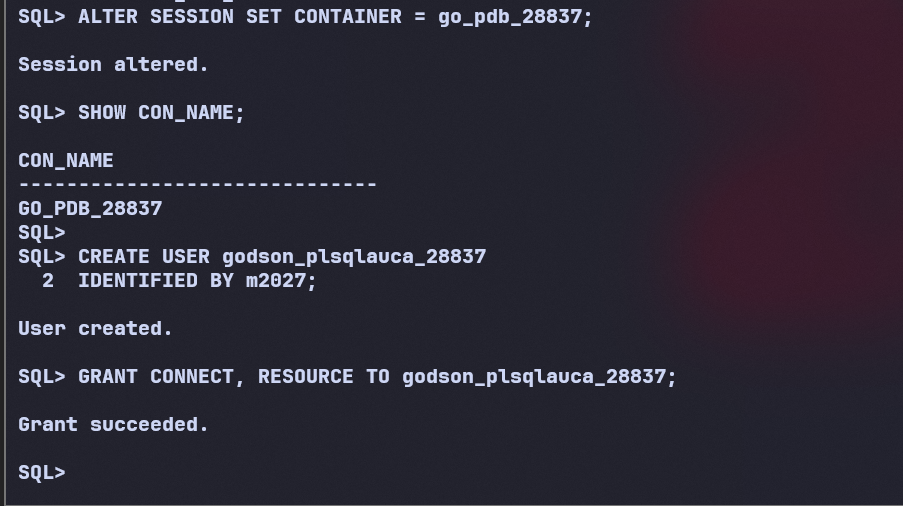
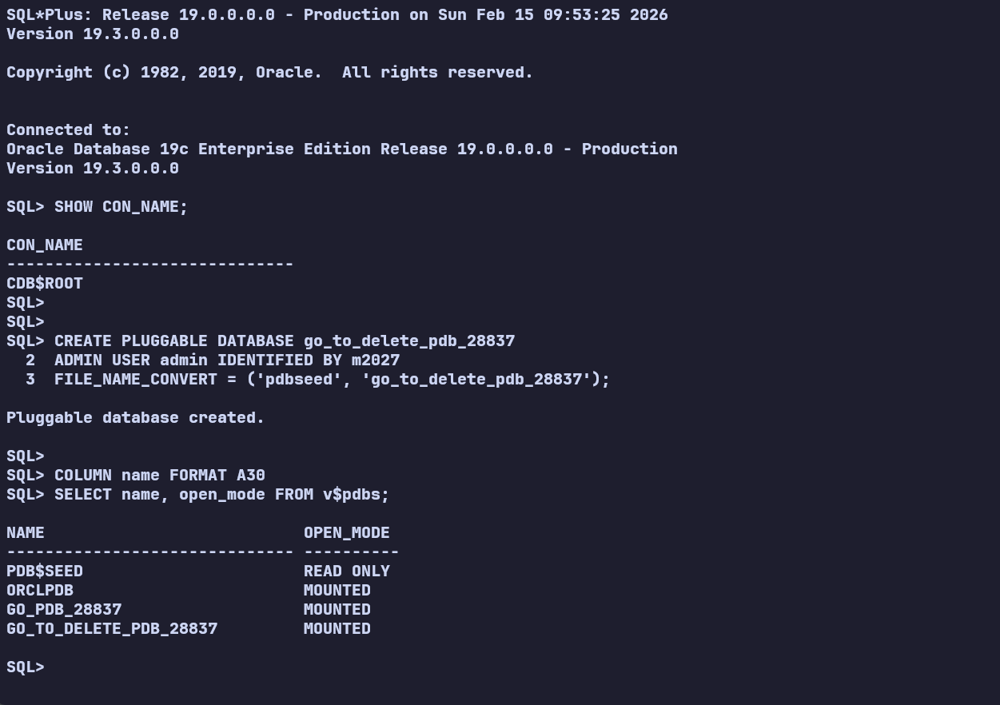
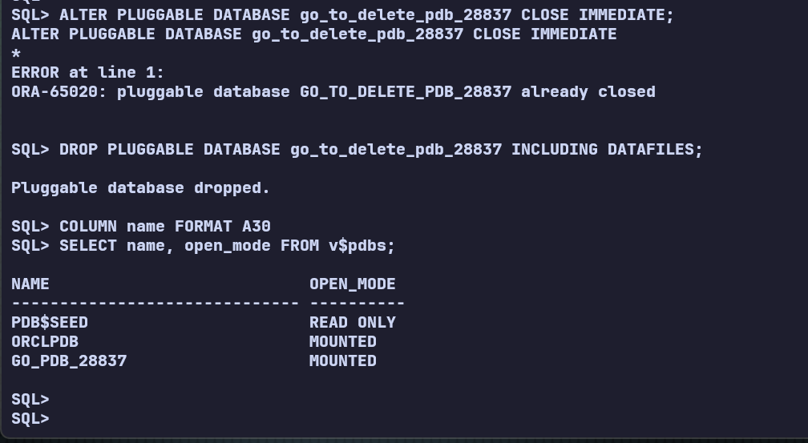
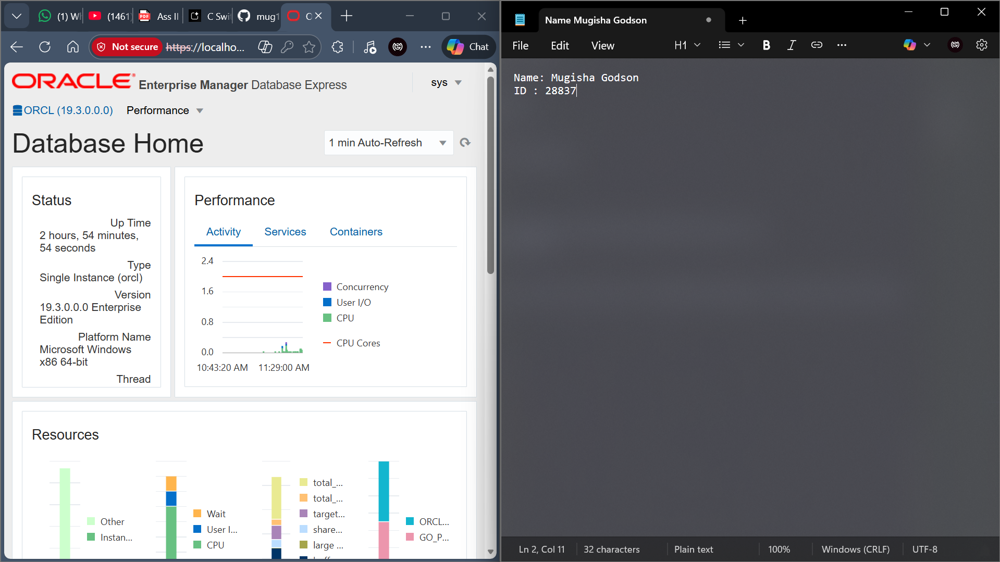

# Oracle Database Administration: Pluggable Databases & OEM

**Student Name:** Godson Mugisha  
**Student ID:** 28837  
**Date:** February 15, 2026  

---

## Project Overview
This repository documents the completion of three key database administration tasks using **Oracle Database 19c**:
1.  **PDB Management:** Creation and configuration of a persistent Pluggable Database (PDB) with a specific application user.
2.  **Lifecycle Management:** Creation and complete deletion of a temporary PDB.
3.  **Monitoring:** Configuration and access of the Oracle Enterprise Manager (OEM) Express dashboard.

All tasks were performed via the Command Line Interface (SQL*Plus) and verified using the OEM Web Dashboard.

---

## Task 1: Create a New Pluggable Database

**Objective:** Create a PDB named `go_pdb_28837` and a dedicated user `godson_plsqlauca_28837`

### 1. PDB Creation & Open
Executed the following commands to create the PDB using the `pdbseed` template and open it for use.

```sql
-- Create the Pluggable Database
CREATE PLUGGABLE DATABASE go_pdb_28837
ADMIN USER pdbadmin IDENTIFIED BY m2027
FILE_NAME_CONVERT = ('pdbseed', 'go_pdb_28837');

-- Open the PDB
ALTER PLUGGABLE DATABASE go_pdb_28837 OPEN;


-- Verify Status
SHOW PDBS;

```

Screenshot showing the successful creation and READ WRITE open mode of the PDB.


2. User Creation
Switched the session container to the new PDB to create the required user and grant privileges.
code

```sql
SQL
-- Switch Session to the new PDB
ALTER SESSION SET CONTAINER = go_pdb_28837;

-- Create the required user
CREATE USER godson_plsqlauca_28837 IDENTIFIED BY m2027;

-- Grant permissions
GRANT CONNECT, RESOURCE TO godson_plsqlauca_28837;

-- Verify User Creation
SELECT username FROM dba_users WHERE username = 'GODSON_PLSQLAUCA_28837';

```

Screenshot showing the user GODSON_PLSQLAUCA_28837 exists inside the PDB.


Task 2: Create and Delete a PDB
Objective: Demonstrate the ability to create a temporary PDB (go_to_delete_pdb_28837) and completely remove it from the system.
1. Creation and Verification
The temporary PDB was created successfully.
code


SQL
```sql
CREATE PLUGGABLE DATABASE go_to_delete_pdb_28837
ADMIN USER admin IDENTIFIED BY m2027 
FILE_NAME_CONVERT = ('pdbseed', 'go_to_delete_pdb_28837');

```

Screenshot showing the temporary PDB in the list before deletion.


2. Deletion
The PDB was closed and dropped, including its datafiles.
code
SQL
```sql
-- Close the PDB
ALTER PLUGGABLE DATABASE go_to_delete_pdb_28837 CLOSE IMMEDIATE;

-- Drop the PDB (Including Datafiles)
DROP PLUGGABLE DATABASE go_to_delete_pdb_28837 INCLUDING DATAFILES;

-- Confirm Deletion
COLUMN name FORMAT A30
SELECT name, open_mode FROM v$pdbs;

```

Screenshot showing the PDB list effectively removed go_to_delete_pdb_28837.



Task 3: Oracle Enterprise Manager (OEM)
Objective: Configure the Global Port and access the OEM Express Dashboard to monitor the environment.

1. Port Configuration
Configured the XDB HTTPS port to 5500 and ensured the Listener was active.
code
SQL

```sql
-- Check current port configuration
SELECT DBMS_XDB_CONFIG.GETHTTPSPORT() FROM DUAL;

-- Enable Port 5500
EXEC DBMS_XDB_CONFIG.SETHTTPSPORT(5500);

```

2. Dashboard Access
Accessed https://localhost:5500/em using SYS credentials.

Screenshot of the OEM Dashboard showing the status of CDB$ROOT, ensuring the deleted PDB is not present, and displaying the active user.




Repository Link: [\[GitHub URL\]](https://github.com/mug1sha/-oracle_pdb_ass_II_28837_Godson.git).

PDB Name Created: go_pdb_28837.


Issues Encountered: No

## Checklist
- [X] User created inside the PDB
- [X] Temporary PDB created and deleted
- [X] OEM dashboard screenshot included
- [X] GitHub repository is PUBLIC
- [X] README is clear and professional
- [X] Deadline respected


